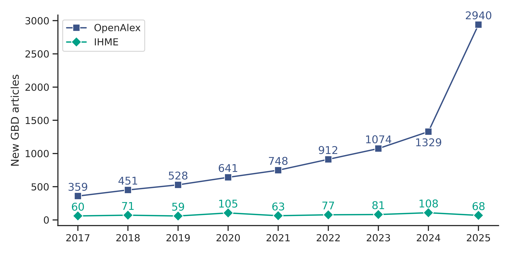
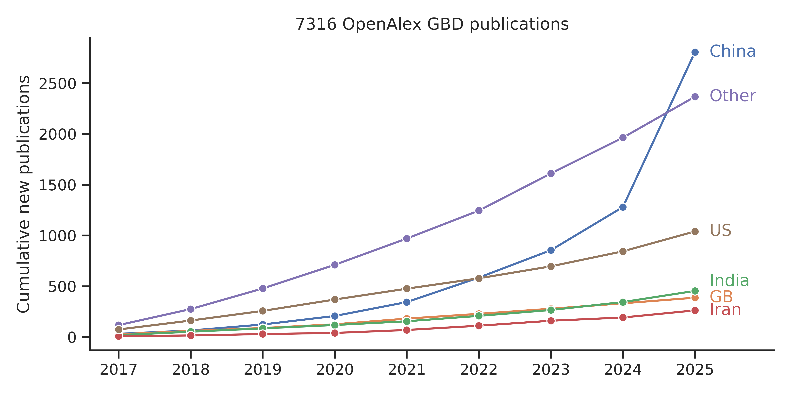

One of the key pillars of the Open Science movement focuses on making research data publicly available for reuse. However, a number of recent studies have raised concerns regarding the exploitation of public health databases for low-quality, mass-produced research papers. For example, [Suchak et al. (2025)](https://doi.org/10.1371/journal.pbio.3003152) report an "explosion of formulaic research articles" based on the NHANES US national health database. A preprint by [Collins et al. (2026)](https://osf.io/preprints/metaarxiv/zwexr_v1/) finds similarly worrying results for the National Cancer Institute's SEER database. [Spick et al. (2026)]( https://doi.org/10.1016/j.jclinepi.2026.112203) identified 9 out of 36 public health databases showing hallmarks of mass-produced research, including NHANES, SEER, and the Global Burden of Disease Study (GBD). The latter is examined in a new preprint by [Degen et al. (2026)](https://doi.org/10.31222/osf.io/8f7zu_v1), where we compare secondary analyses of GBD data with primary analyses by the Institute of Health Metrics and Evaulation (IHME), which runs the GBD research program.

<figure style="margin:0;">
  
  <figcaption style="margin-top:0.5rem; font-size:0.9em;">
    Explosive rise in GBD publications (primary and secondary analyses) found in OpenAlex compared to a constant rate of primary analyses by IHME-affiliated authors.
  </figcaption>
</figure>

A natural suspect for the explosion of mass-produced public health articles are *paper mills*: "organisations or individuals that aim to profit from the creation, sale, peer review and/or citation of manuscripts at scale which contain low value or fraudulent content and/or authorship, with the aim of publication in scholarly journals" ([United2Act](https://osf.io/dhtzb/files/vzq78) definition). Alarmingly, a study by [Richardson et al. (2025)](https://doi.org/10.1073/pnas.2420092122) shows that the growth rate of suspected paper mill publications is already outpacing that of legitimate research.

Several factors contextualize the success of paper mills. For one, the "publish or perish" culture of scientific research prioritizes the quantity of publications for individual career advancement. Another factor is the [dominance of commercial publishers](https://doi.org/10.3998/ptpbio.3363), which profit from article processing charges and are thus incentivized to increase the overall volume of publications. Although these are issues plaguing the global scientific community, certain regions are particularly susceptible to paper mill activity due to local conditions. Regarding the exploitation of public health databases, China emerges as the main driver of mass-produced papers. As science integrity expert Elizabeth Bik explains in a [discussion on paper mills](https://publicationethics.org/topic-discussions/systematic-manipulation-publishing-process-paper-mills) with the Committee On Publication Ethics (COPE):

> This is a particular problem for doctors at Chinese hospitals because they have a requirement to publish a paper to finish medical school or to get a promotion, which will mean they will earn more money. Usually these doctors are underpaid, and to support their families they need the promotion and hence they need to publish one scientific paper, even though they might not be interested in doing research. Despite this requirement, they are not given time off from their busy clinic schedule to do research, and they usually do not work at a hospital with research facilities. Yet they are expected to write a research paper. So, when companies offer to give them authorship on a paper in return for money, they usually see this as a small investment to make a living.

<figure style="margin:0;">
  
  <figcaption style="margin-top:0.5rem; font-size:0.9em;">
    Cumulative new GBD publications since 2017 for top 5 countries and all other countries combined.
  </figcaption>
</figure>

Under these circumstances, it is natural to suspect that the surge in mass-produced public health articles from China can be attributed to paper mills. However, there is also an alternative explanation. The emergence of large language models has substantially lowered the burden for superficially plausible scientific writing. In combination with streamlined workflows for data analysis and visualization, "outsourcing" manuscript generation to a paper mill may no longer justify the associated costs and risks. When paper mill activity is identified, it can lead to the [mass retraction](https://retractionwatch.com/category/mass-retractions/) of hundreds of articles. Thus, a safer and cheaper alternative for authors in need of a quick publication is to simply "mill" the paper themselves—with the help of appropriate tools.

In the new preprint by [Degen et al. (2026)](https://doi.org/10.31222/osf.io/8f7zu_v1), we identify a Guangzhou-based company that specializes in exactly this. In addition to offering subscription services for AI-driven scientific writing and grant preparation, the company sells proprietary R packages designed to streamline the analysis of specific public health databases. These include the "GlobalBurdenR" package for GBD data, the "nhanesPro" package for NHANES data, the "seerSurvivalR" package for SEER data, and others. A GlobalBurdenR [video tutorial](https://www.bilibili.com/video/BV1utZRYxESP/?spm_id_from=333.788.recommend_more_video.0&trackid=web_related_0.router-related-2479604-fc7wt.1773329093351.714) with 22’000 views promises viewers to "create 2 GBD database SCI papers in 4 hours". Another [video tutorial](https://www.bilibili.com/video/BV1UPUNYxEw8/?spm_id_from=333.1387.homepage.video_card.click) promises viewers to "achieve mass production SCI" using NHANES data. The following offer from a [text tutorial](https://zhuanlan.zhihu.com/p/1915450940309341085) on GlobalBurdenR makes it clear that the package is advertised as a direct competitor to paper mills:

Original:

> 如果你找数据分析服务外包，光一个普通的分析可能就需要 3000 元。如果再加上可视化图表、趋势预测、Joinpoint 分析，费用轻松破万。而GlobalburdenR 的价格只需要1980 元，就能让你随时随地拥有这些功能，想用几次用几次！

Translation (via Google):

> If you outsource data analysis services, a simple analysis might cost 3,000 yuan. If you add visualization charts, trend forecasting, and joinpoint analysis, the cost can easily exceed 10,000 yuan. The GlobalburdenR is priced at only 1980 yuan, allowing you to have these features anytime, anywhere, and use them as many times as you like!

Of course, using R packages for efficient data analysis is common practice. However, as we write in our manuscript: "concerns arise when those packages are undocumented in the scientific literature, access is hidden behind paywalls, source code is not openly available, and usage is undisclosed by authors. Such barriers seriously impede transparency and reproducibility, undermining trust in the underlying research." As more than 99% of the 713 secondary GBD studies we investigated failed to share analysis code publicly, we were unable to conclusively quantify the extent to which authors relied on GlobalBurdenR for their analysis. Based on cross-referencing article figures with those shown in tutorials, we suspect that it is a substantial fraction.

On the spectrum of questionable research practices, articles published using such streamlined workflows may occupy a gray zone between a paper mill product and a standard research paper. As paper mills operate in a coordinated manner and oftentimes use completely fraudulent methods such as data fabrication and image duplication, the term [paper mine](https://www.tandfonline.com/doi/full/10.1080/08989621.2026.2626740) may be more appropriate to refer to the phenomenon of uncoordinated mass-production of articles exploiting real, high-quality public databases.

In the best case scenario, the respective R packages are made open source, verified by the scientific community to yield robust and methodologically valid results, and transparently used by domain-experts in public health to standardize and speed up boilerplate work. However, as it stands, there is ample reason to remain skeptical of paper mine articles. In an editorial published by the journal *Cephalagia* (the medical term for headache), [Husøy et al. (2025)](https://doi.org/10.1177/0333102425139288) find that secondary analyses of GBD headache data are prone to errors and misinterpretations, with many papers displaying "limited or no understanding of GBD". One can only hope that [recent policy changes](https://www.science.org/content/article/journals-and-publishers-crack-down-research-open-health-data-sets) from publishers will help stem the flood of questionable papers from the assembly line.
